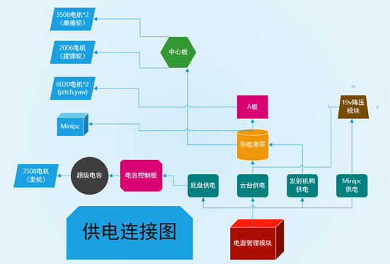
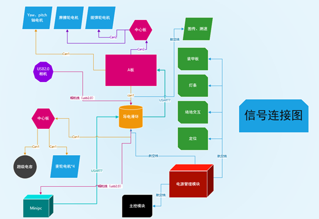
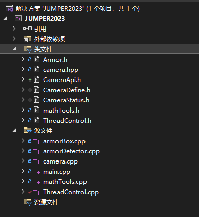
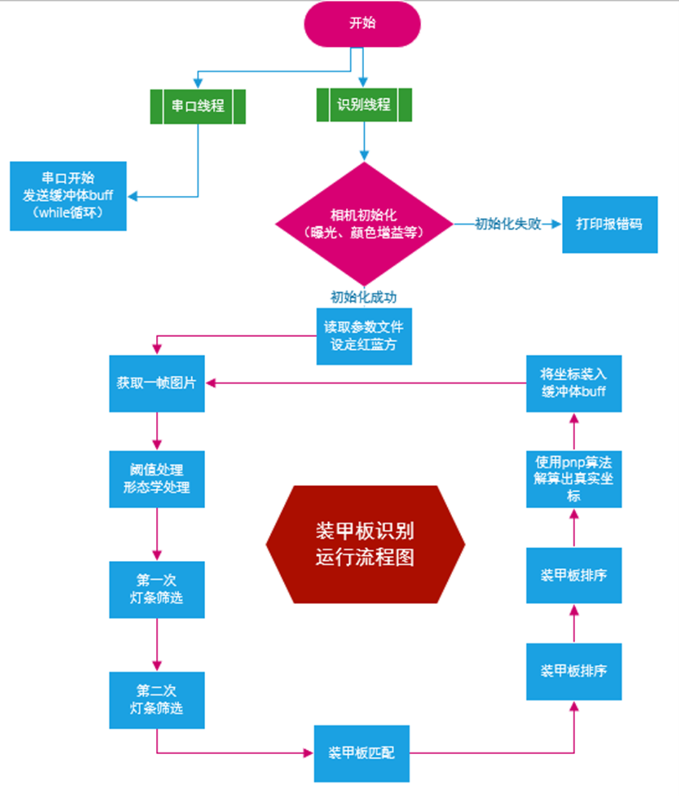
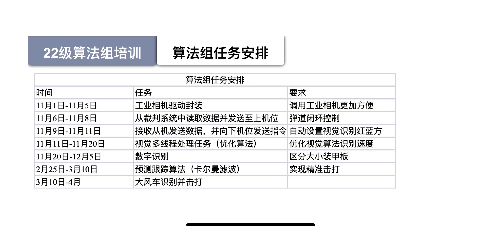

# RM2023_VS
贵州师范学院Jumper战队2022视觉项目

## 简介

1. 硬件配置

- 运算平台：NUC8 i5 
- 摄像头： Mindvision MV-USB32GC 或者 usb免驱相机


2. 实现功能

- 传统视觉自瞄

3. 部署需要调节的参数有

- 传统视觉相机参数，如曝光，增益等
- 相机内参数
- USB转串口设备名字
- 传统视觉识别参数，如二值化阈值,灯条装甲板几何约束参数

## 环境配置

#### Ubuntu 20.04 LTS（此项目目前未部署在linux平台）
- gcc 7.5.0
- OpenCV 4.5.5
- cmake 3.5.0

#### Windows 11/10 
- Visual Studio 2022
- OpenCV 4.6.0  
环境配置链接教程:
https://blog.csdn.net/mars_xiaolei/article/details/78759041


## 硬件连接





## 文件结构

```txt
|--SRC
    |--src
        |--armorBox.cpp   装甲板类
        |--armorDetector.cpp   装甲板识别类
        |--main.cpp        主函数（线程起始位置）
        |--mathTools.cpp   角度解算
        |--serial.cpp      串口库
        |--ThreadControl.cpp  包含串口发送、图像识别线程

    |--inc   头文件存放处
        |--ThreadControl.h   
        |--serial.hpp
        |--mathTools.h
        |--Armor.h

    |--device  设备驱动库
        |--camera.cpp 对相机驱动进行二次封装
        |--camera.hpp
        |--mindvison  迈德威视摄像头原始驱动
            |--CameraApi.h
            |--CameraDefine.h
            |--CameraStatus.h

|
```
## 代码规范

| 规范      | 含义 |示例|
| ----------- | ----------- |-----------|
| 首字母大写，单词间大写区分      | 文件名,类名    | ArmorBlob: 即ArmorBlob类|
| 首字母小写，单词间大写区分   | 函数名        |initHog: 即Hog初始化函数|
| 首字母小写，单词以下划线区分   | 变量        |lut_table: LUT表格|
| 全小写，名词为变量，动词为函数   | 一些简单变量以及含义明确的函数        |Kalman类的predict: 卡尔曼滤波预测过程|


## 如何使用？

1. 
```
   使用vs新建空的cpp控制台项目，将项目文件导入，选择调试编译
```

2. 

```
    插入usb相机或mindvison相机
```

3. 
```
    编译运行
```

## 算法演示

见video文件夹

## 程序框图



## 优化方向


